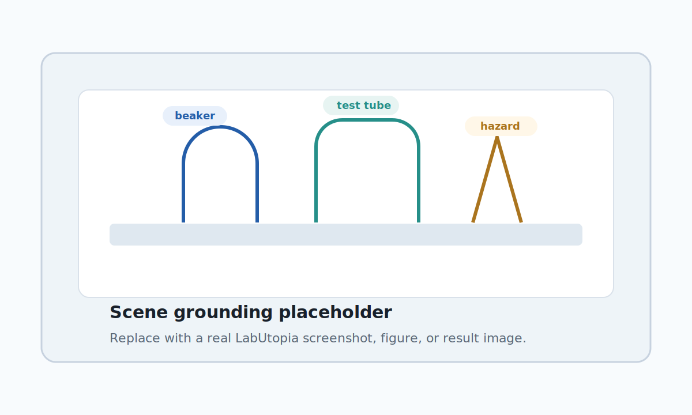

# AcademicDeck

A quiet, reusable HTML presentation template for research group meetings.

AcademicDeck is a small static HTML/CSS template for group meeting talks, weekly research updates, proposal discussions, paper reading, and experiment demos. It is designed to be calm, readable, and easy to reuse without a slide framework or build step.

## Features

- Academic Clean visual style: white slide surface, thin borders, restrained shadows, blue + teal identity accents.
- Full HTML template in `index.html` with neutral English placeholder content.
- Generated meeting decks in `decks/`.
- Shared runtime in `scripts/presentation.js` for keyboard navigation, scroll synchronization, and automatic slide numbering.
- Image, video, before/after, and key-frame media page types.
- Explicit browser resolution tiers for compact preview, 1080p, 2K, and 4K.
- Print/PDF CSS with a 16:9 page target.
- Structural validation scripts with no external dependencies.
- Keynote-compatible AcademicDeck theme source in `themes/`.
- Distributable Codex skill in `skills/academic-deck-html/`.

## Project Structure

```text
.
├── index.html
├── styles.css
├── scripts/
│   └── presentation.js
├── assets/
│   └── scene-grounding-placeholder.svg
├── decks/
│   └── labutopia-hrc-weekly.html
├── tests/
│   ├── validate-template.mjs
│   ├── validate-deck.mjs
│   └── validate-skill.mjs
├── skills/
│   └── academic-deck-html/
│       └── SKILL.md
├── themes/
│   ├── AcademicDeck-Keynote-Theme.key
│   ├── AcademicDeck-Keynote-Theme.pptx
│   └── README.md
├── tools/
│   ├── create-keynote-theme.mjs
│   └── install-skill.mjs
├── package.json
└── README.md
```

## Quick Start

1. Duplicate `index.html` into `decks/` for a new talk.
2. Replace the placeholder text while keeping the slide structure.
3. Put local images and videos in `assets/`.
4. Open the copied HTML file directly in a browser.
5. Run validation before sharing or committing.

```bash
npm run validate
```

No install step is required for validation because the scripts only use Node.js built-in modules.

## Codex Skill

This repository can be reused with the local `academic-deck-html` skill. Use it when asking Codex to create or revise group meeting HTML decks, research progress reports, paper walkthroughs, or media-heavy academic presentations based on AcademicDeck.

The skill keeps concrete meeting content in `decks/`, preserves the English reusable template in `index.html`, and requires `npm run validate` before completion.

### One-Line Codex Install

Give Codex this sentence while it is opened in the AcademicDeck repository:

```text
请在当前 AcademicDeck 仓库运行 npm run install:skill，把 academic-deck-html 安装到 ~/.codex/skills。
```

Install the skill into a peer Codex skills directory:

```bash
npm run install:skill
```

Default install location:

```text
~/.codex/skills/academic-deck-html/SKILL.md
```

Override the install root when needed:

```bash
ACADEMIC_DECK_SKILL_DIR="$HOME/.agents/skills" npm run install:skill
```

The repository copy at `skills/academic-deck-html/SKILL.md` is the source of truth. Installed copies are generated from it.

## Keynote Theme

Build the Keynote-compatible theme source:

```bash
npm run build:keynote-theme
```

Generated file:

```text
themes/AcademicDeck-Keynote-Theme.pptx
```

The native Keynote source is also saved at:

```text
themes/AcademicDeck-Keynote-Theme.key
```

Use the `.key` file for normal Keynote reuse. Keep the `.pptx` source when you need a portable editable file.

## Reuse Rules

Keep each slide in this shape:

```html
<section class="slide" data-slide-type="progress-snapshot">
  <div class="slide-frame">
    <div class="topline">
      <span class="badge">Progress Snapshot</span>
      <span>Context</span>
    </div>

    <div>
      <!-- slide content -->
    </div>

    <div class="footer">
      <span>Footer label</span>
      <span class="slide-page"></span>
    </div>
  </div>
</section>
```

The shared runtime fills `.slide-page` automatically. Do not hard-code footer page numbers.

If your deck is copied next to `index.html`, keep:

```html
<script src="scripts/presentation.js"></script>
```

If your deck lives under `decks/`, use:

```html
<script src="../scripts/presentation.js"></script>
```

## Media

Place local assets in `assets/` and reference them with relative paths.

```html

```

```html
<video controls preload="metadata">
  <source src="assets/demo-execution.mp4" type="video/mp4">
</video>
```

The template intentionally avoids remote assets so talks keep working offline.

## Slide Types

The template includes these page types:

- Cover / summary
- Progress snapshot
- Architecture / pipeline
- Metrics / results
- Risk / decision table
- Next-step plan
- Single image explanation
- Video with timestamp notes
- Before / after comparison
- Key-frame sequence
- Related work brief
- Proposal / idea pitch
- Discussion request
- Appendix / backup

## Academic Clean

The default visual language is Academic Clean:

- quiet white slide surface
- thin borders and restrained shadows
- blue + teal identity line
- low-saturation semantic colors
- fixed media regions
- no remote assets
- no decorative illustration layer

## Resolution Tiers

AcademicDeck uses explicit CSS tiers instead of one large responsive jump:

- compact browser preview: under `1200px`
- 1080p browser presentation: `@media (min-width: 1200px)`, `--slide-max: 1500px`
- 2K browser presentation: `@media (min-width: 1900px)`, `--slide-max: 1880px`
- 4K browser presentation: `@media (min-width: 3000px)`, `--slide-max: 3000px`

Most sizing is driven by custom properties such as `--slide-pad-x`, `--cover-title-size`, `--slide-title-size`, `--subtitle-size`, `--body-card-size`, and `--media-min`. Tune those tokens before editing individual slide markup.

## Validation

Run all checks:

```bash
npm run validate
```

Run checks individually:

```bash
npm run validate:template
npm run validate:deck
npm run validate:skill
```

The validators check required files, slide types, local asset references, responsive tiers, print rules, shared runtime usage, generated deck structure, and the distributable skill contract.
